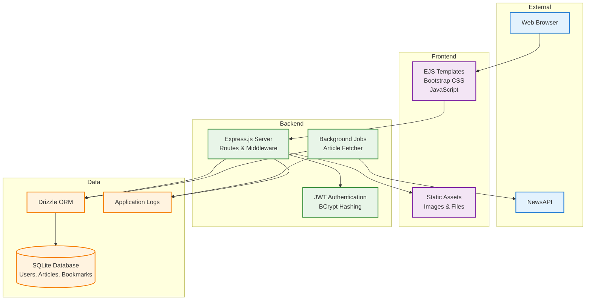
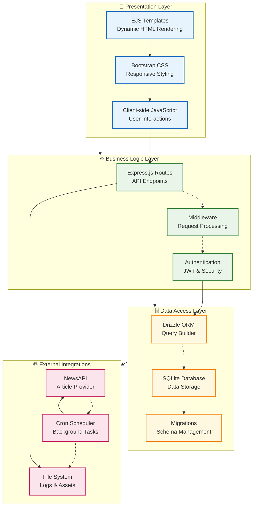
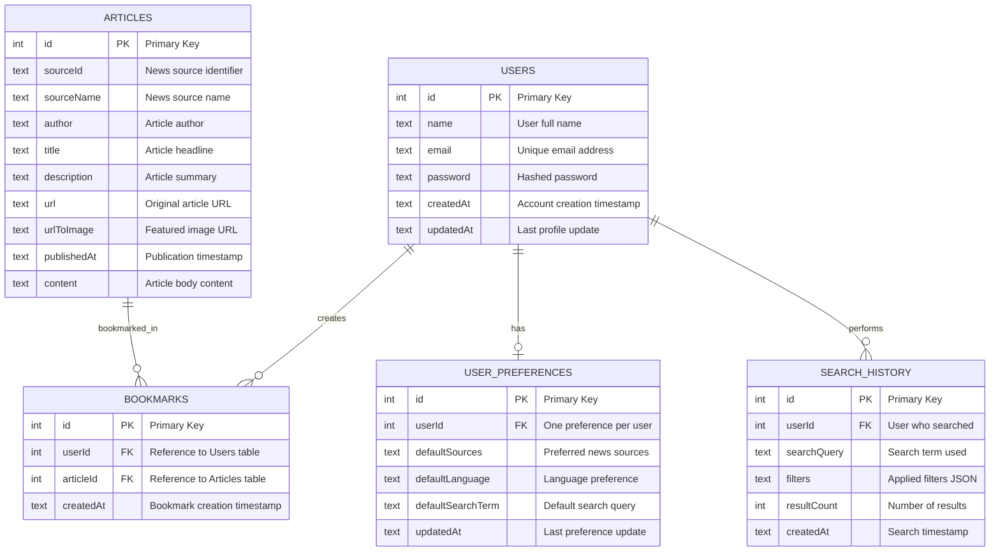

# ArticleDesk - System Architecture Overview

## Architecture Diagram

```mermaid
graph TB
    %% External Layer
    subgraph "External Services"
        NewsAPI[NewsAPI<br/>News Data Provider]
        Browser[Web Browser<br/>Chrome, Firefox, Safari]
    end

    %% Presentation Layer
    subgraph "Presentation Layer"
        subgraph "Client-Side"
            HTML[HTML Templates<br/>EJS Views]
            CSS[CSS Styling<br/>Bootstrap 5 + Custom]
            JS[Client JavaScript<br/>ES6+ Features]
        end

        subgraph "Static Assets"
            Images[Images<br/>Placeholders & Icons]
            PublicJS[Public JS Files]
            PublicCSS[Public CSS Files]
        end
    end

    %% Application Layer
    subgraph "Application Layer"
        subgraph "Express.js Server"
            Router[Express Router<br/>Route Handling]
            Middleware[Middleware Stack<br/>Auth, CORS, Parsing]
            Controllers[Route Controllers<br/>Business Logic]
        end

        subgraph "Route Modules"
            AuthRoutes[Auth Routes<br/>/api/auth/*]
            ArticleRoutes[Article Routes<br/>/api/articles/*]
            BookmarkRoutes[Bookmark Routes<br/>/api/bookmarks/*]
            ViewRoutes[View Routes<br/>/ /search /bookmarks]
        end

        subgraph "Authentication"
            JWT[JWT Service<br/>Token Generation/Validation]
            BCrypt[Password Hashing<br/>bcryptjs]
            AuthMiddleware[Auth Middleware<br/>Required & Optional]
        end
    end

    %% Background Services
    subgraph "Background Services"
        CronJob[Cron Scheduler<br/>node-cron]
        ArticleFetcher[Article Fetcher<br/>NewsAPI Integration]
        LogManager[Log Manager<br/>File-based Logging]
    end

    %% Data Layer
    subgraph "Data Layer"
        subgraph "Database"
            SQLite[(SQLite Database<br/>local.db)]
            DrizzleORM[Drizzle ORM<br/>Type-safe Queries]
        end

        subgraph "Schema"
            UsersTable[Users Table<br/>Authentication Data]
            ArticlesTable[Articles Table<br/>News Content]
            BookmarksTable[Bookmarks Table<br/>User Preferences]
            PreferencesTable[User Preferences<br/>Settings & History]
        end
    end

    %% File System
    subgraph "File System"
        Logs[Log Files<br/>app.log, cron.log, error.log]
        StaticFiles[Static Files<br/>CSS, JS, Images]
        Config[Configuration<br/>.env, drizzle.config.js]
    end

    %% Connections
    Browser --> HTML
    Browser --> CSS
    Browser --> JS

    JS --> Router
    HTML --> ViewRoutes

    Router --> Middleware
    Middleware --> Controllers
    Controllers --> AuthRoutes
    Controllers --> ArticleRoutes
    Controllers --> BookmarkRoutes
    Controllers --> ViewRoutes

    AuthRoutes --> JWT
    AuthRoutes --> BCrypt
    AuthRoutes --> AuthMiddleware

    ArticleRoutes --> DrizzleORM
    BookmarkRoutes --> DrizzleORM
    AuthRoutes --> DrizzleORM

    DrizzleORM --> SQLite
    SQLite --> UsersTable
    SQLite --> ArticlesTable
    SQLite --> BookmarksTable
    SQLite --> PreferencesTable

    CronJob --> ArticleFetcher
    ArticleFetcher --> NewsAPI
    ArticleFetcher --> DrizzleORM

    Controllers --> LogManager
    CronJob --> LogManager
    LogManager --> Logs

    Router --> StaticFiles
    StaticFiles --> Images
    StaticFiles --> PublicJS
    StaticFiles --> PublicCSS

    %% Styling
    classDef external fill:#e1f5fe
    classDef presentation fill:#f3e5f5
    classDef application fill:#e8f5e8
    classDef data fill:#fff3e0
    classDef background fill:#fce4ec
    classDef filesystem fill:#f1f8e9

    class NewsAPI,Browser external
    class HTML,CSS,JS,Images,PublicJS,PublicCSS presentation
    class Router,Middleware,Controllers,AuthRoutes,ArticleRoutes,BookmarkRoutes,ViewRoutes,JWT,BCrypt,AuthMiddleware application
    class SQLite,DrizzleORM,UsersTable,ArticlesTable,BookmarksTable,PreferencesTable data
    class CronJob,ArticleFetcher,LogManager background
    class Logs,StaticFiles,Config filesystem
```

## Architecture Overview

ArticleDesk follows a **layered architecture pattern** with clear separation of concerns across multiple tiers. The system is designed for scalability, maintainability, and security while providing a seamless user experience for news aggregation and bookmarking.

### Key Architecture Principles

1. **Separation of Concerns**: Each layer has distinct responsibilities
2. **Modularity**: Components are loosely coupled and highly cohesive
3. **Scalability**: Architecture supports horizontal and vertical scaling
4. **Security**: Multiple security layers protect user data and system integrity
5. **Maintainability**: Clean code structure facilitates updates and debugging

## Layer Descriptions

### 1. External Services Layer

**Components:**

-   **NewsAPI**: Third-party news data provider
-   **Web Browsers**: Client-side user interface platforms

**Responsibilities:**

-   Provide real-time news data from multiple sources
-   Render user interface and handle user interactions
-   Support cross-browser compatibility

### 2. Presentation Layer

**Components:**

-   **EJS Templates**: Server-side rendering with dynamic content
-   **Bootstrap 5 + Custom CSS**: Responsive styling framework
-   **Client-side JavaScript**: Dynamic user interactions and API communication
-   **Static Assets**: Images, icons, and client-side resources

**Responsibilities:**

-   Render dynamic HTML content based on server data
-   Provide responsive, mobile-first user interface
-   Handle client-side form validation and interactions
-   Manage static resource delivery

### 3. Application Layer

**Core Components:**

-   **Express.js Router**: HTTP request routing and handling
-   **Middleware Stack**: Request processing pipeline
-   **Route Controllers**: Business logic implementation

**Route Modules:**

-   **Authentication Routes** (`/api/auth/*`): User registration, login, profile management
-   **Article Routes** (`/api/articles/*`): Article search, retrieval, and listing
-   **Bookmark Routes** (`/api/bookmarks/*`): Bookmark CRUD operations
-   **View Routes**: Server-side rendered pages

**Security Components:**

-   **JWT Service**: Token-based authentication
-   **BCrypt**: Password hashing and verification
-   **Authentication Middleware**: Route protection and user context

**Responsibilities:**

-   Process HTTP requests and generate responses
-   Implement business logic and validation rules
-   Manage user authentication and authorization
-   Coordinate between presentation and data layers

### 4. Background Services Layer

**Components:**

-   **Cron Scheduler**: Automated task scheduling
-   **Article Fetcher**: NewsAPI integration and data synchronization
-   **Log Manager**: Application logging and monitoring

**Responsibilities:**

-   Automatically fetch and update news articles
-   Schedule recurring tasks (hourly article updates)
-   Manage application logs and error tracking
-   Ensure data freshness and system monitoring

### 5. Data Layer

**Database Components:**

-   **SQLite Database**: Lightweight, file-based data storage
-   **Drizzle ORM**: Type-safe database operations and query building

**Schema Components:**

-   **Users Table**: User authentication and profile data
-   **Articles Table**: News article content and metadata
-   **Bookmarks Table**: User-article relationship mapping
-   **User Preferences Table**: Personalization and settings

**Responsibilities:**

-   Persist application data with ACID compliance
-   Provide efficient data retrieval and manipulation
-   Maintain data integrity and relationships
-   Support complex queries and filtering

### 6. File System Layer

**Components:**

-   **Log Files**: Application, cron, and error logs
-   **Static Files**: CSS, JavaScript, and image assets
-   **Configuration Files**: Environment variables and database configuration

**Responsibilities:**

-   Store and manage log files for debugging and monitoring
-   Serve static assets to the presentation layer
-   Maintain configuration and environment settings

## Data Flow Architecture

### User Request Flow

1. **Client Request**: Browser initiates HTTP request
2. **Routing**: Express router determines appropriate handler
3. **Middleware Processing**: Authentication, parsing, validation
4. **Controller Logic**: Business logic execution
5. **Database Operations**: Data retrieval/manipulation via Drizzle ORM
6. **Response Generation**: JSON or HTML response preparation
7. **Client Response**: Data sent back to browser

### Article Fetching Flow

1. **Cron Trigger**: Scheduled job initiates article fetch
2. **NewsAPI Request**: External API call for latest articles
3. **Data Processing**: Article data validation and transformation
4. **Duplicate Check**: Prevent duplicate article storage
5. **Database Insert**: New articles saved to database
6. **Logging**: Operation results logged for monitoring

### Authentication Flow

1. **User Credentials**: Login request with email/password
2. **Validation**: Input validation and sanitization
3. **Password Verification**: BCrypt hash comparison
4. **Token Generation**: JWT token creation with user claims
5. **Cookie Setting**: Secure HTTP-only cookie with token
6. **Protected Access**: Middleware validates token for protected routes

## Technology Stack Integration

### Backend Technologies

-   **Node.js**: JavaScript runtime environment
-   **Express.js**: Web application framework
-   **Drizzle ORM**: Database abstraction layer
-   **SQLite**: Embedded database engine

### Frontend Technologies

-   **EJS**: Server-side templating engine
-   **Bootstrap 5**: CSS framework for responsive design
-   **Vanilla JavaScript**: Client-side interactivity

### Security & Authentication

-   **JWT**: Stateless authentication tokens
-   **bcryptjs**: Password hashing library
-   **HTTP-only Cookies**: Secure token storage

### Automation & Integration

-   **node-cron**: Task scheduling
-   **node-fetch**: HTTP client for API calls
-   **NewsAPI**: External news data source

## Deployment Architecture

### Production Environment

-   **Process Management**: Background processes for main app and cron jobs
-   **Log Management**: Centralized logging with rotation
-   **Environment Configuration**: Secure environment variable management
-   **Database Management**: SQLite with automated backups

### Scalability Considerations

-   **Stateless Design**: JWT-based authentication supports horizontal scaling
-   **Database Optimization**: Indexed queries and efficient schema design
-   **Caching Strategy**: Potential for Redis integration
-   **Load Balancing**: Architecture supports multiple server instances

## Security Architecture

### Multiple Security Layers

1. **Input Validation**: Server-side validation for all user inputs
2. **Authentication**: JWT-based stateless authentication
3. **Authorization**: Role-based access control for protected resources
4. **Password Security**: BCrypt hashing with salt
5. **Session Management**: Secure HTTP-only cookies
6. **Error Handling**: Secure error messages without information leakage

### Security Best Practices

-   HTTPS enforcement in production
-   CORS configuration for cross-origin requests
-   Rate limiting for API endpoints
-   SQL injection prevention through parameterized queries
-   XSS protection through input sanitization

This architecture provides a solid foundation for a scalable, secure, and maintainable news aggregation platform while following modern web development best practices.

## Simplified Architecture Diagram (For Reports)

For report attachments and presentations, here's a condensed version of the architecture:

### Simplified Architecture Summary

This condensed diagram shows the four main architectural layers:

1. **External**: NewsAPI data source and web browser clients
2. **Frontend**: User interface components and static assets
3. **Backend**: Core application server, authentication, and background services
4. **Data**: Database operations, data storage, and application logging

The simplified version maintains the essential data flow while reducing visual complexity, making it ideal for academic reports, presentations, and high-level documentation.

## System Components Diagram

This diagram shows the detailed breakdown of components within each architectural layer:

### Component Layer Breakdown

**📱 Presentation Layer:**

-   **EJS Templates**: Server-side rendering with dynamic content injection
-   **Bootstrap CSS**: Responsive framework for consistent UI styling
-   **Client-side JavaScript**: Interactive features and API communication

**⚙️ Business Logic Layer:**

-   **Express.js Routes**: RESTful API endpoints and view routing
-   **Middleware**: Request processing, parsing, and validation pipeline
-   **Authentication**: JWT token management and security enforcement

**🗄️ Data Access Layer:**

-   **Drizzle ORM**: Type-safe database query builder and operations
-   **SQLite Database**: Lightweight, file-based data persistence
-   **Migrations**: Version-controlled database schema management

**🌐 External Integrations:**

-   **NewsAPI**: Third-party news article data provider
-   **Cron Scheduler**: Automated background task execution
-   **File System**: Log management and static asset storage

This layered architecture ensures clear separation of concerns, making the system maintainable, testable, and scalable.

## Database Schema Diagram

This Entity Relationship Diagram (ERD) shows the database structure and relationships between tables:

### Database Schema Overview

**Core Tables:**

-   **USERS**: Stores user authentication and profile information

    -   Primary Key: `id` (auto-increment)
    -   Unique Constraint: `email` for login identification
    -   Security: `password` field stores bcrypt hashed passwords

-   **ARTICLES**: Contains news article data fetched from NewsAPI

    -   Primary Key: `id` (auto-increment)
    -   External Reference: `sourceId` links to news provider
    -   Content Fields: Full article data including title, description, content

-   **BOOKMARKS**: Junction table creating many-to-many relationship
    -   Primary Key: `id` (auto-increment)
    -   Foreign Keys: `userId` and `articleId` create the relationship
    -   Timestamp: `createdAt` tracks when bookmark was saved

**Extended Tables:**

-   **USER_PREFERENCES**: Stores personalization settings

    -   One-to-one relationship with USERS
    -   Customizable default search parameters

-   **SEARCH_HISTORY**: Tracks user search behavior
    -   One-to-many relationship with USERS
    -   Analytics data for search improvements

### Relationship Types

-   **Users ↔ Bookmarks**: One-to-Many (One user can have multiple bookmarks)
-   **Articles ↔ Bookmarks**: One-to-Many (One article can be bookmarked by multiple users)
-   **Users ↔ User Preferences**: One-to-One (Each user has one preference record)
-   **Users ↔ Search History**: One-to-Many (One user can have multiple search records)

This normalized database design ensures data integrity, prevents redundancy, and supports efficient querying for the ArticleDesk application.
